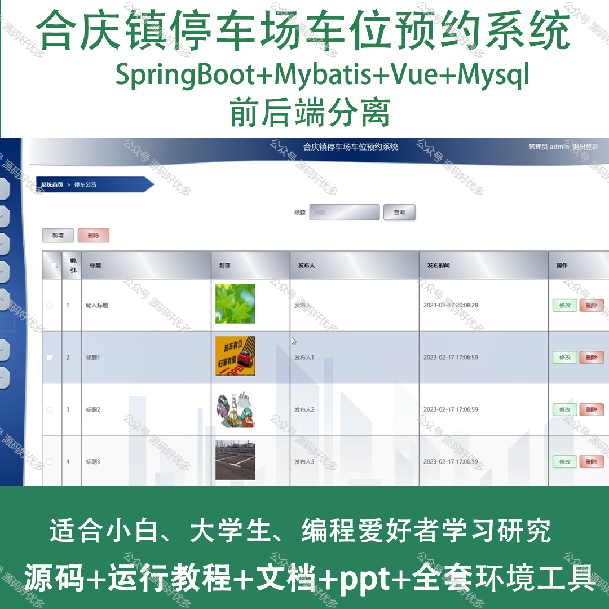
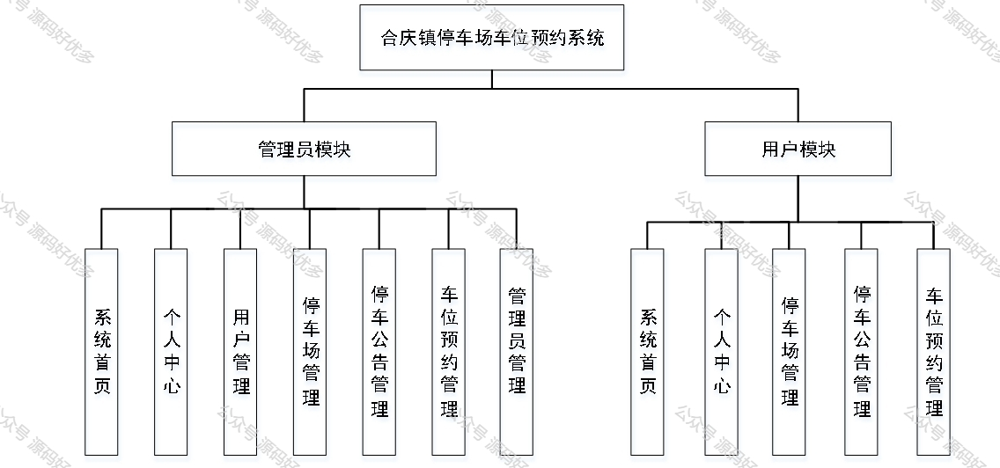
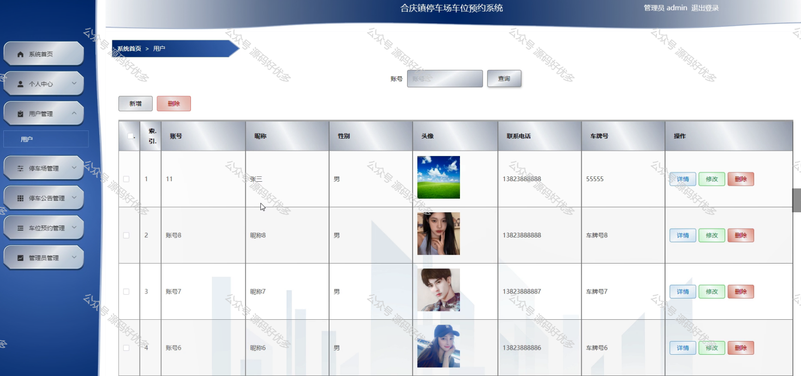
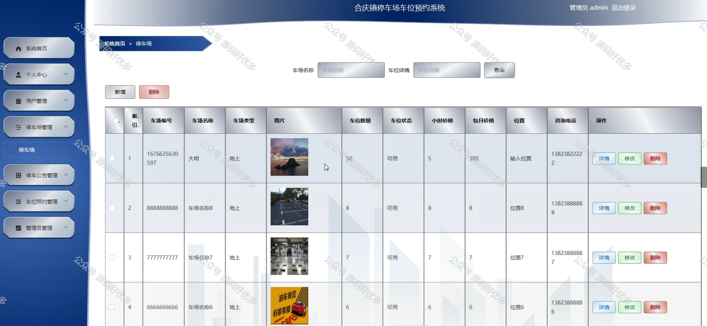
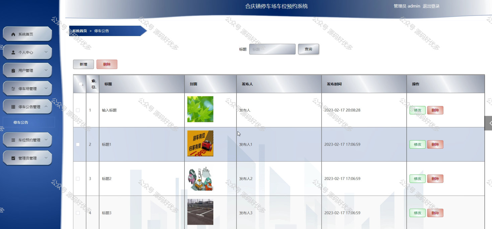
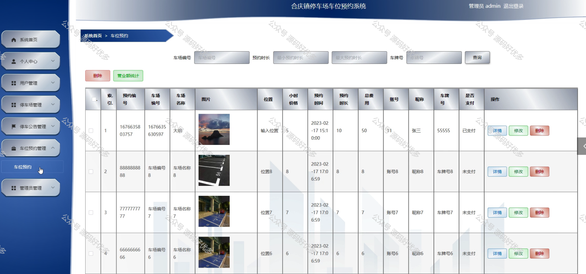
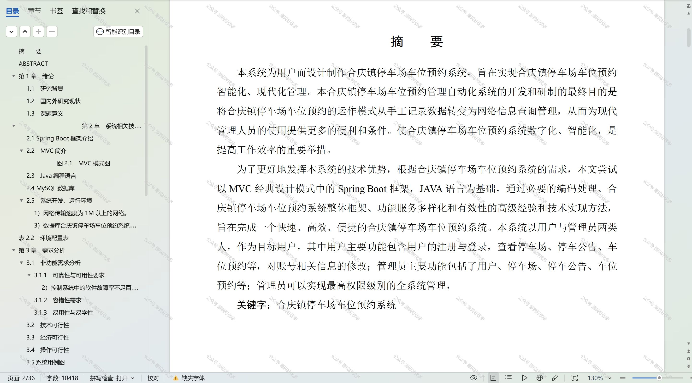

 
## 查看主页获取源码

### 一、作品包含

源码+数据库+设计文档万字+PPT+全套环境和工具资源+部署教程

### 二、项目技术

前端技术：Html、Css、Js、Vue、Element-ui

数据库：MySQL

后端技术：Java、Spring Boot、MyBatis

  

### 三、运行环境

开发工具：IDEA/eclipse

数据库：MySQL5.7

数据库管理工具：Navicat10以上版本

环境配置软件： JDK1.8+Maven3.6.3

前端Nodejs：14

### 四、项目介绍
项目编号：springbootA190

合庆镇作为我国快速发展的城镇之一，随着经济的持续增长和居民生活水平的提高，汽车保有量逐年攀升，导致停车难问题日益凸显。为有效缓解这一问题，本研究以合庆镇停车场为对象，探讨构建一套车位预约系统，以提高停车场资源利用率，优化停车体验，为解决城镇停车难题提供理论依据和技术支持。

系统分为管理员和用户
管理员的功能：系统首页、个人中心、用户管理、停车场管理、停车公告管理、车位预约管理和管理员管理。
用户的功能：系统首页、个人中心、停车场管理、停车公告管理、车位预约管理。

### 五、运行截图

  
